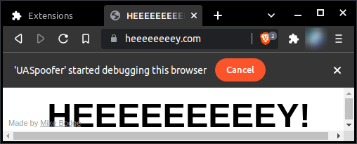

 

✨ Lie about your browser and computer while surfing the web. ✨

<h1>UASpoofer</h1> 

## About
An extension for Chromium-based desktop browsers that can spoof the browser's `navigator.userAgent` property with a more common user agent.

This extension provides user agent strings describing some Windows, MacOS, Linux, iOS, and Android devices using Google Chrome, Microsoft Edge, Safari, and Firefox browsers. The extension can replace your browser's original `navigator.userAgent` property with a user agent you select for all open tabs.

This extension can also copy the user agent string to the clipboard and test the window navigator of your browser. Clicking the test button will direct you to the [creepjs](https://abrahamjuliot.github.io/creepjs/) website.  Scroll down to the Navigator section to determine whether the user agent was changed. 
  

## Usage
### Loading Extension to Browser
This extension can be used on any desktop Chromium-based browser (eg. Google Chrome, Microsoft Edge, Chromium, etc.)

1. Clone this repo locally or download the source code of the main branch. Fork this repo if you want to contribute to development. 
2. Open any Chromium based browser and navigate to **`chrome://extensions`**.
3. To use the unpacked extension, turn on developer mode, click **Load Unpacked**, and select the directory containing the `manifest.json` file. 

### Hide Notification about this Extension Debugging the Browser

This notification won't go away on its own because the extension doesn't stop debugging the browser. It can be prevented from popping up by using  `--silent-debugger-extension-api` command line switch in a shortcut to your browser.

## Limitations
### Internet Explorer User Agent String Options
User agent strings aren't stored as a constant anywhere in this program. They are simply generated when you select a device/operating system and a browser. The information about the device/operating system is cocantenated to the part of the user agent string with information about navigator.appVersion. Then information about the browser is cocantenated to this. For most versions of IE, information about the browser is addeded before information about the device/operating system. These strings simply cannot be generated by this program.

### Inconsistencies in Spoofing UserAgent
When visiting the creepjs website to help test and debug this program, the tab had to be refreshed 1-3 times for changes to be reflected. Also this extension could only be used to change the user agent string 1-3 times before the creepjs website began displaying the real useragent in the Navigator section. Finally, creepjs can detect that your user agent was spoofed and reveals the real user agent in the Worker section of the site.

### Lack of Testing
This extension has only been tested on Brave and Google Chrome. Issues from other browsers are unknown.

## Technologies and Projects Used
- HTML, CSS, Vanilla JS, [jquery](https://code.jquery.com)
- [Chrome Extension APIs](https://developer.chrome.com/docs/extensions/reference/) 
- [tabler icons](https://tabler-icons.io/) for the icon
- [creepjs](https://abrahamjuliot.github.io/creepjs/) by [abrahamjuliot](https://github.com/abrahamjuliot)
- [Most Common User Agents](https://techblog.willshouse.com/2012/01/03/most-common-user-agents/) by Tech Blog (wh) for user agent strings.
