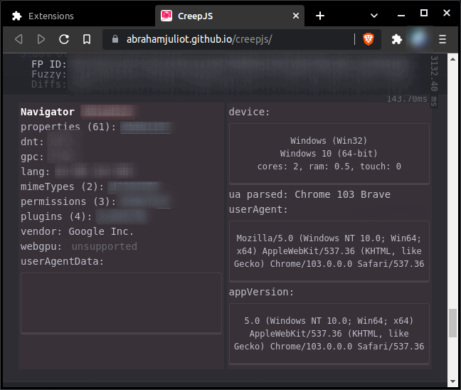

# UASpoofer
## About
A user agent spoofer for desktop chromium based browsers.


This extension provides user agent strings describing some Windows, MacOS, Linux, iOS, and Android devices using Google Chrome, Microsoft Edge, Safari, and Firefox browsers. 

This extension can also copy the user agent string to the clipboard and test the `navigator` of your browser. Clicking the test button will redirect you to [creepjs website](https://abrahamjuliot.github.io/creepjs/).  Scroll down to the Navigator section of the website to determine whether the user agent was changed.

<figcaption align = "center" style="font-size:12px;">Navigator section of the creepjs website</figcaption>


Finally, this extension can apply the modified user agent string to all tabs. It will also apply it when tabs are opened or refreshed. You can also reset the user agent string back to the original one.

## Usage
### Loading Extension to Browser
This extension can be used on any desktop chromium based browser (eg. Google Chrome, Microsoft Edge, Chromium, etc.)

1. To use the unpacked extension, either fork this repo or download the source code of the main branch. 
2. Open any Chromium based browser and navigate to **`chrome://extensions`**.
3. To use the unpacked extension, turn on developer mode, click **Load Unpacked**, and select the directory containing the `manifest.json` file. 

### Hide the Notification about this Extension debugging the browser
This notification won't go away on its own because the extension doesn't stop debugging the browser. You can prevent it from popping up by using the `--silent-debugger-extension-api`.


### Setting User Agent Manually
Do this if you want to use a user agent string that can't be selected. You can set it before applying changes across your browser.
1. Open the extension popup
2. Right click anywhere on the popup and click **Inspect**.
3. Type in the following (replace `"my custom user agent"` to any string you want)
``` javascript
document.getElementById("ua-str").innerHTML = "my custom user agent";
```
4. Return to the extension and click **APPLY TO ALL WINDOWS** to apply changes.

## Limitations
### Internet Explorer User Agent String Options
User agent strings aren't stored as a constant anywhere in this program. They are simply generated when you select a device/operating system and a browser. The information about the device/operating system is cocantenated to the part of the user agent string with information about navigator.appVersion. Then information about the browser is cocantenated to this. For versions of IE older than version 11, information about the browser is addeded before information about the device/operating system. These strings simply cannot be generated by this program. If you want to use an older user agent string, then it must be set manually.   

### Lack of Testing
This extension has only been tested on Brave and Google Chrome. Issues related to other browsers are unknown as of now.

## Resources
Special thanks to these projects and technologies:
- [jquery 3.6.0](https://code.jquery.com/jquery-3.6.0.js)
- [Chrome Extension APIs](https://developer.chrome.com/docs/extensions/reference/) 
- [cssgradient.io](https://cssgradient.io/) for generating the background gradient
- [Material Symbols and Icons](https://fonts.google.com/icons) for the icon
- [creepjs](https://abrahamjuliot.github.io/creepjs/) webapp by [abrahamjuliot](https://github.com/abrahamjuliot) to test the user agent
- [Most Common User Agents](https://techblog.willshouse.com/2012/01/03/most-common-user-agents/) and [whatismybrowser.com Web Browser User Agents database](https://developers.whatismybrowser.com/useragents/explore/software_type_specific/web-browser/2) for user agent strings
